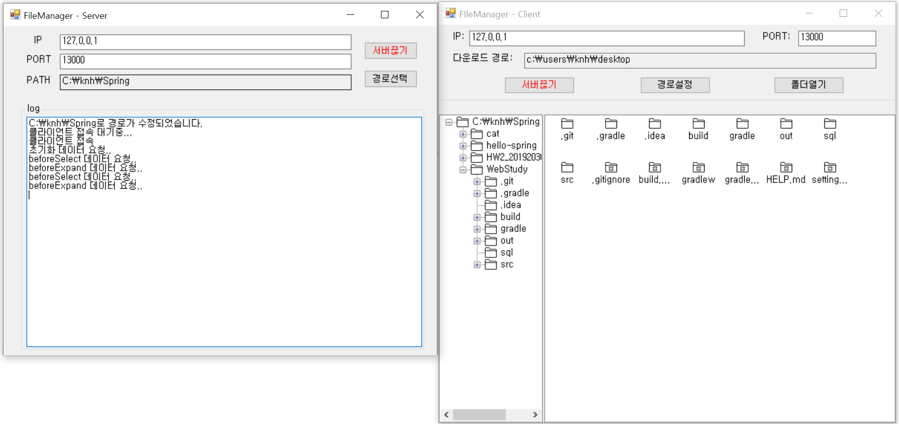

# Remote File Manager

### 3. 개요 
      C#과 소켓 통신을 이용한 원격 파일 탐색기를 만든다. 

### 2. 기능 
      서버 경로의 파일을 클라이언트에서 탐색가능 
      폴더 더블 클릭 시 트리구조 확장 및 하위 파일 표시 
      파일 더블 클릭 시 파일의 상세 정보 표시 가능 
      파일의 종류에 따라 아이콘을 다르게 표시 
      
      우 클릭시 context menu 출력
      해당 매뉴를 통해 다운로드, 상세 정보 보기 기능 사용가능 
      다운로드 시 클라이언트의 경로로 서버의 파일 다운로드 가능 
      자세히/ 큰 아이콘/ 작은 아이콘/ 간단히로 출력가능 
      
      모든 과정은 server에 로그로 표시 
      

### 3. 실행 화면 

